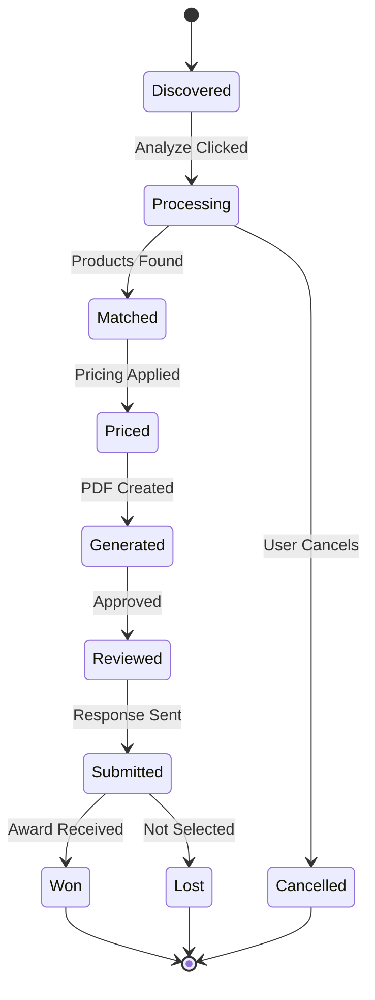

# RFP Processing Workflow

Complete end-to-end workflow for processing RFPs in the Haki FMCG system.

## 📋 Workflow Stages

### Stage 1: RFP Discovery & Ingestion
**Goal:** Capture new RFPs from various sources

#### Automated Sources
- **GeM Portal** - Government e-Marketplace tenders
- **CPWD** - Central Public Works Department
- **Procurement Portals** - State/Municipal tenders
- **Email Monitoring** - RFP notifications
- **Website Scanners** - Organization procurement pages

#### Manual Upload
1. Navigate to **Submit RFP** page
2. Fill RFP details:
   - Title
   - Customer/Buyer name
   - Submission deadline (2025-2026 only)
   - Estimated value
3. Upload PDF document (optional)
4. Click **Submit RFP**

**Output:** RFP created with status `discovered`

---

### Stage 2: AI Extraction & Analysis
**Goal:** Parse RFP requirements using AI

#### Multi-Agent Processing
The system launches 4 parallel agents:

**1. Extraction Agent**
- Parses PDF/text content
- Identifies key requirements
- Extracts technical specifications
- Detects quantity requirements
- Maps to product categories

**2. Compliance Agent**
- Checks industry standards (IS, IEC, BSI)
- Validates certification requirements
- Flags mandatory compliances
- Assesses risk factors

**3. Technical Agent**
- Analyzes technical specs
- Matches with product capabilities
- Identifies gaps/challenges
- Suggests alternatives

**4. Pricing Agent**
- Estimates budget requirements
- Calculates volume discounts
- Analyzes competitor pricing
- Determines win probability

#### Monitoring Progress
1. Go to **Enhanced Dashboard**
2. Click **Analyze** on any RFP
3. Modal shows real-time progress:
   - Current stage percentage
   - Active agents status
   - Estimated time remaining
   - Processing tips

**Output:** RFP status → `processing`, extracted data stored

---

### Stage 3: Product Matching
**Goal:** Find suitable products from 50K+ catalog

#### Matching Algorithm
1. **Semantic Search**
   - Vector embeddings of requirements
   - Similarity scoring with products
   - Top-N candidate selection

2. **Specification Matching**
   - Technical specs comparison
   - Tolerance checking
   - Standards compliance verification

3. **Category Filtering**
   - Brand preference application
   - Stock availability check
   - Lead time validation

4. **Scoring & Ranking**
   - Match confidence score
   - Compliance rating
   - Pricing competitiveness
   - Delivery feasibility

#### Match Results Display
- Table view with:
  - Product details (code, name, specs)
  - Match confidence percentage
  - Unit price and total cost
  - Stock status
  - Compliance badges

**Output:** List of matched products with scores

---

### Stage 4: Pricing & Quote Generation
**Goal:** Calculate competitive pricing

#### Pricing Engine Logic
```
Base Price = MRP × (1 - Standard Discount)
Volume Discount = Based on quantity tiers
Strategic Discount = Win probability optimization
Final Price = Base Price - Volume Discount - Strategic Discount
```

#### Discount Tiers
- **0-100 units:** 5-10%
- **100-500 units:** 10-15%
- **500-1000 units:** 15-20%
- **1000+ units:** 20-25%

#### Win Probability Factors
- Days until deadline
- Estimated competition
- Stock availability
- Historical win rate
- Customer relationship

**Output:** Priced quote with margins

---

### Stage 5: Response Document Generation
**Goal:** Create professional PDF response

#### Document Sections
1. **Cover Page**
   - Company branding
   - RFP reference number
   - Submission date
   - Contact information

2. **Executive Summary**
   - Brief overview
   - Key highlights
   - Value proposition

3. **Technical Compliance**
   - Requirement-by-requirement match
   - Specification comparison table
   - Standards certification proof
   - Test reports references

4. **Product Details**
   - Product catalog entries
   - Technical datasheets
   - Manufacturer information
   - Warranty terms

5. **Pricing Table**
   - Line-item breakdown
   - Quantity × Unit Price
   - Taxes and duties
   - Total contract value
   - Payment terms

6. **Delivery & Support**
   - Lead times
   - Installation support
   - Training offered
   - After-sales service

7. **Company Profile**
   - Certifications (ISO, etc.)
   - Past experience
   - Client references
   - Infrastructure details

#### Generation Process
1. Click **Generate Response PDF**
2. Wait for AI formatting (10-30 seconds)
3. Preview generated document
4. Download or edit if needed

**Output:** Professional PDF ready for submission

---

### Stage 6: Review & Approval
**Goal:** Final validation before submission

#### Review Checklist
- [ ] All requirements addressed
- [ ] Pricing competitive and accurate
- [ ] Technical compliance verified
- [ ] No missing information
- [ ] Document formatting professional
- [ ] Contact details correct
- [ ] Deadline confirmed

#### Approval Actions
- **Download PDF** - Save locally
- **Edit Document** - Make modifications
- **Approve & Send** - Mark as ready
- **Submit Response** - Final submission

**Output:** RFP status → `reviewed`

---

### Stage 7: Submission & Tracking
**Goal:** Submit response and monitor outcome

#### Submission Methods
1. **Portal Upload** - GeM/CPWD direct upload
2. **Email** - Send to buyer's email
3. **Manual** - Download for offline submission

#### Post-Submission Tracking
- Submission confirmation
- Buyer queries/clarifications
- Technical evaluation status
- Price negotiation updates
- Award notification

#### Analytics Captured
- Response time (discovery → submission)
- Win/Loss outcome
- Competitor analysis
- Pricing effectiveness
- Customer feedback

**Output:** RFP status → `submitted` or `won`/`lost`

---

## 🔄 Workflow States



## ⏱️ Typical Timelines

| Stage | Duration | Notes |
|-------|----------|-------|
| Discovery | Instant - 24hrs | Depends on source |
| AI Extraction | 2-5 minutes | Parallel processing |
| Product Matching | 30-60 seconds | Vector search optimized |
| Pricing Calculation | 5-10 seconds | Rule-based engine |
| PDF Generation | 10-30 seconds | AI formatting |
| Review & Approval | Manual | User dependent |
| Submission | Instant - 1hr | Portal dependent |

**Total Automated Time:** 3-7 minutes  
**Manual Review Time:** 15-30 minutes  
**End-to-End:** 20-40 minutes per RFP

## 🎯 Success Metrics

### Efficiency KPIs
- **Response Time:** Target < 1 hour
- **Automation Rate:** Target > 80%
- **Error Rate:** Target < 5%

### Quality KPIs
- **Match Accuracy:** Target > 90%
- **Price Competitiveness:** Win Rate > 60%
- **Compliance Score:** Target 100%

### Business KPIs
- **Win Rate:** Target 50-65%
- **Pipeline Value:** Track monthly
- **Customer Satisfaction:** Post-submission surveys

## 🚨 Error Handling

### Common Issues & Resolution

**PDF Parsing Failure**
- Fallback to manual input
- Use OCR for scanned PDFs
- Request editable format from buyer

**No Product Matches**
- Broaden search criteria
- Check alternative categories
- Flag for procurement team

**Pricing Engine Error**
- Use manual override
- Apply standard discount
- Escalate to sales manager

**Generation Timeout**
- Retry with simpler template
- Generate sections separately
- Fall back to Word template

## 📞 Support & Escalation

**Level 1:** System self-healing & auto-retry  
**Level 2:** Dashboard alerts for user action  
**Level 3:** Email notification to admin  
**Level 4:** Manual intervention required

---

**Document Version:** 1.0  
**Last Updated:** December 2025  
**Maintained By:** Haki FMCG Engineering Team
